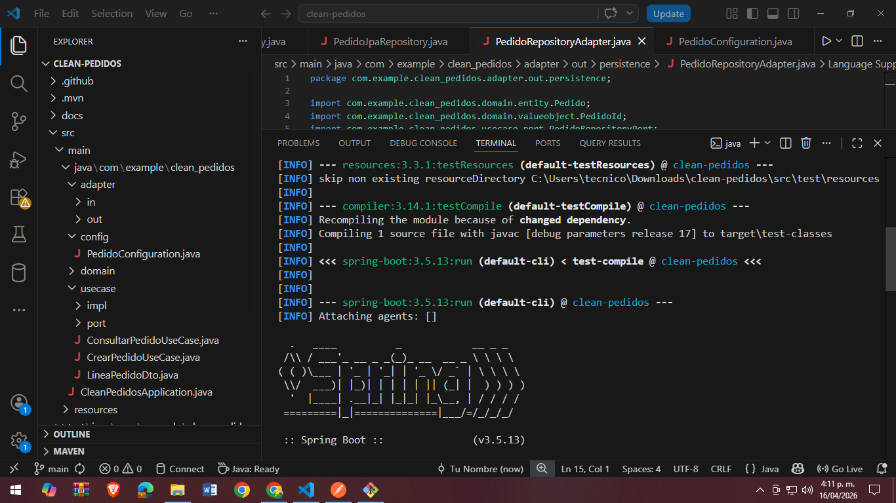
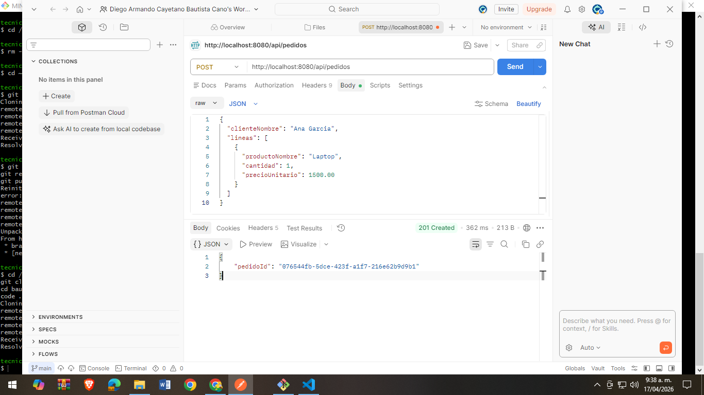
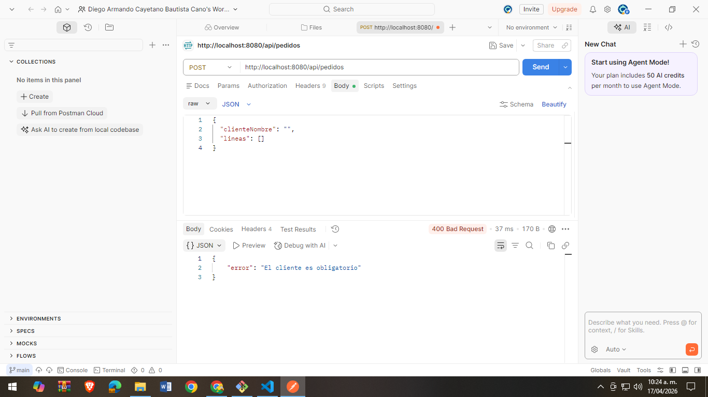
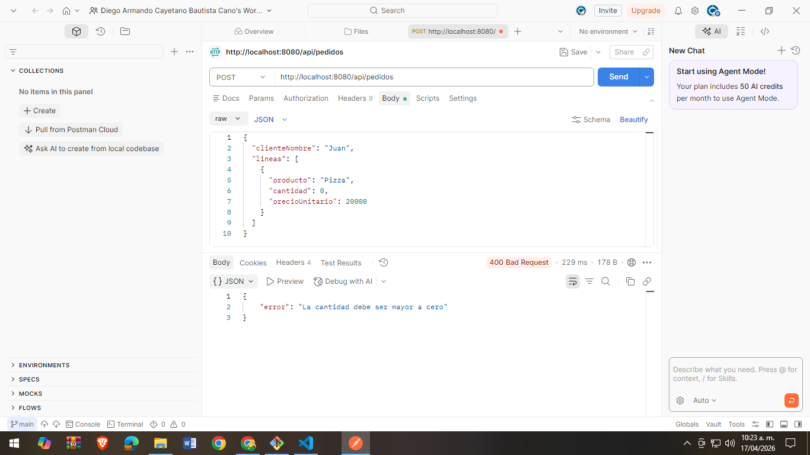
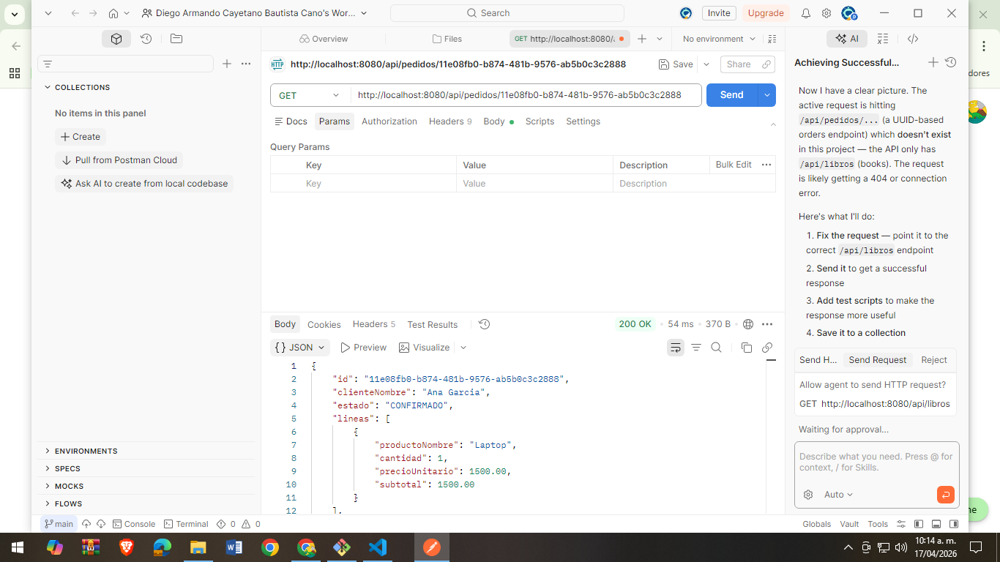
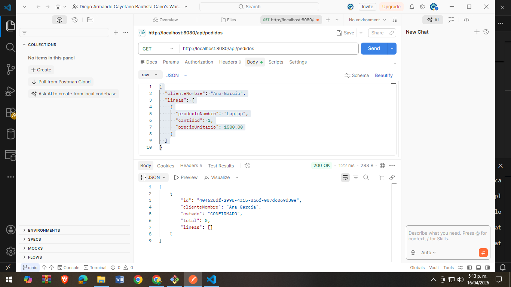
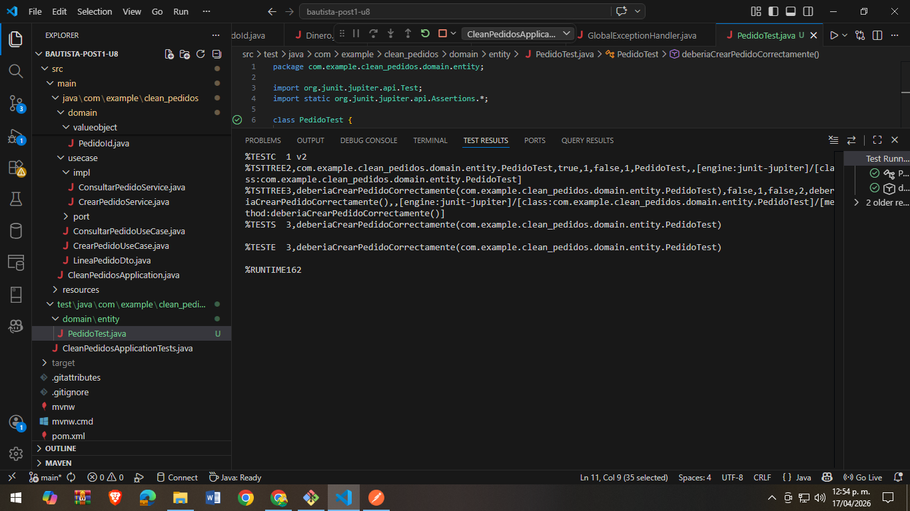
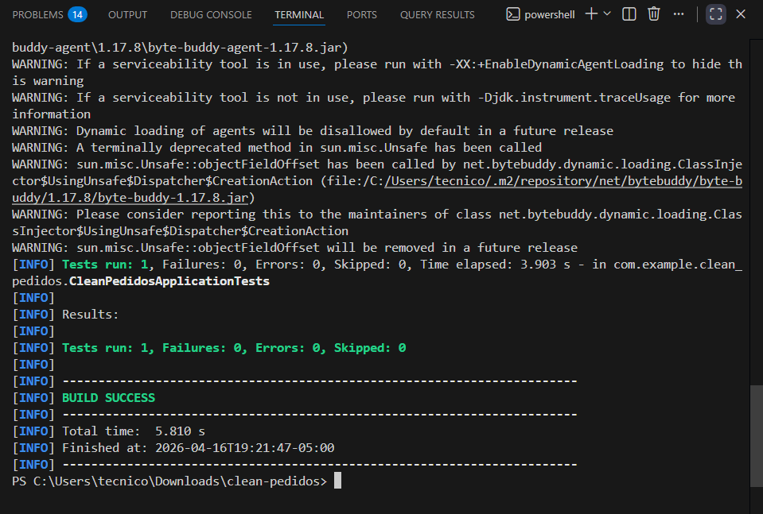
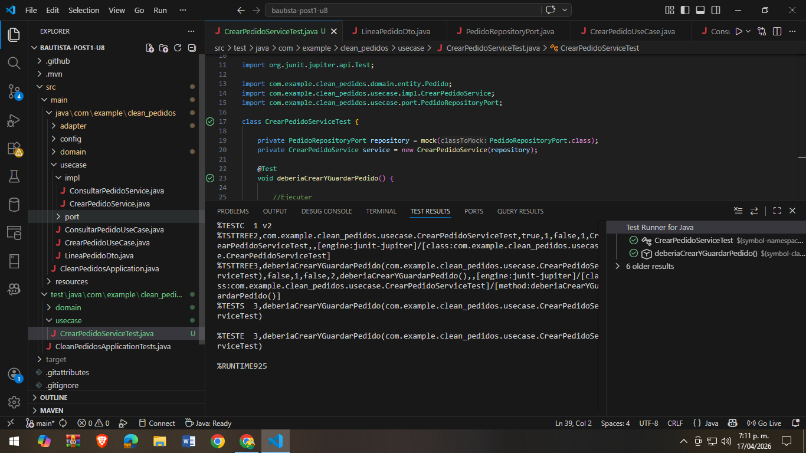

# 📦 Clean Pedidos - Unidad 8

Proyecto implementado con **Clean Architecture** usando Spring Boot.

---

# 🧠 Arquitectura del proyecto

El sistema está dividido en 4 capas:

- **Domain** → Entidades y Value Objects (reglas de negocio puras)
- **Use Cases** → Lógica de aplicación
- **Adapters** → Controladores REST y persistencia
- **Frameworks** → Spring Boot + JPA + H2

🧠 Descripción del desarrollo del proyecto

Este proyecto fue desarrollado como parte de la Unidad 8 de Patrones Arquitectónicos II, aplicando el enfoque de Clean Architecture para la construcción de un sistema de gestión de pedidos.

El desarrollo se realizó organizando el sistema en cuatro capas principales:

Domain: Se implementaron las entidades principales del negocio (como Pedido) y los Value Objects (PedidoId, Dinero, LineaPedido y EstadoPedido). Esta capa contiene toda la lógica de negocio y no depende de ningún framework externo.
Use Cases: Se definieron los casos de uso del sistema (crear y consultar pedidos), aplicando el principio de inversión de dependencias mediante puertos (interfaces) que permiten desacoplar la lógica del dominio de la infraestructura.
Adapters: Se implementaron los controladores REST para la entrada de datos y los adaptadores de persistencia para la comunicación con la base de datos mediante JPA. También se definieron los DTOs para la transferencia de datos entre capas.
Frameworks & Drivers: Se utilizó Spring Boot como framework principal, junto con Spring Data JPA y una base de datos en memoria H2 para la persistencia de datos.

Durante el desarrollo se aplicaron principios de diseño como SOLID, especialmente la inversión de dependencias y la separación de responsabilidades. Además, se realizaron pruebas unitarias con JUnit 5 y Mockito para validar la lógica del dominio y los casos de uso sin necesidad de levantar el contexto completo de Spring.

Finalmente, se realizaron pruebas funcionales utilizando herramientas como Postman o curl para verificar el correcto funcionamiento de los endpoints REST, validando tanto casos exitosos como casos de error controlados por la lógica del dominio.

Este enfoque permitió obtener un sistema modular, escalable y fácil de mantener, cumpliendo con los principios de Clean Architecture.

# 🧪 Evidencias del sistema

---

## 🚀 Ejecución del programa

---

## 📥 Pedido creado correctamente

---

## ❌ Validación: cliente vacío

---

## ❌ Validación: cantidad menor a 0

---

## 📋 Obtener pedido por ID

---

## 📋 Listar pedidos

---

## 🧪 Test con JUnit

---

## 🧪 Test del dominio (PedidoTest)

---

## 🧪 Test con Mockito (Service)

---

# 🧠 Arquitectura

- Domain (sin frameworks)
- Use Cases (lógica de negocio)
- Adapters (REST + persistencia)
- Frameworks (Spring Boot)

---

# 👨‍💻 Autor

Diego Armando Cayetano Bautista Cano - Universidad de Santander
2026
